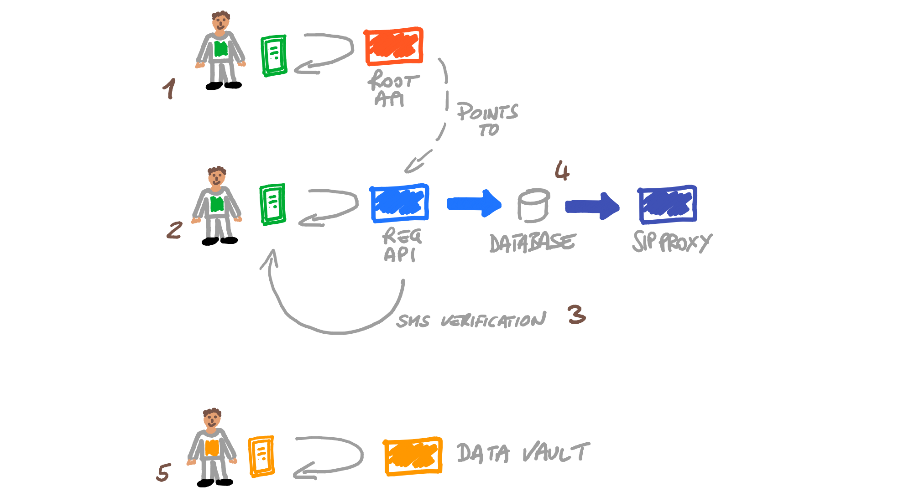
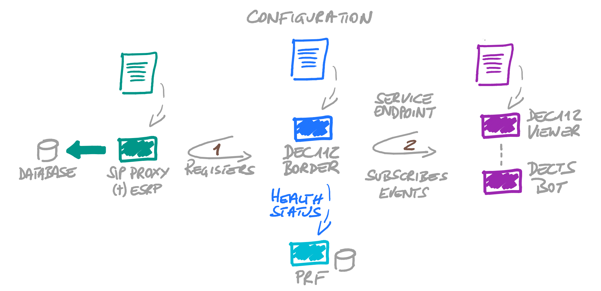
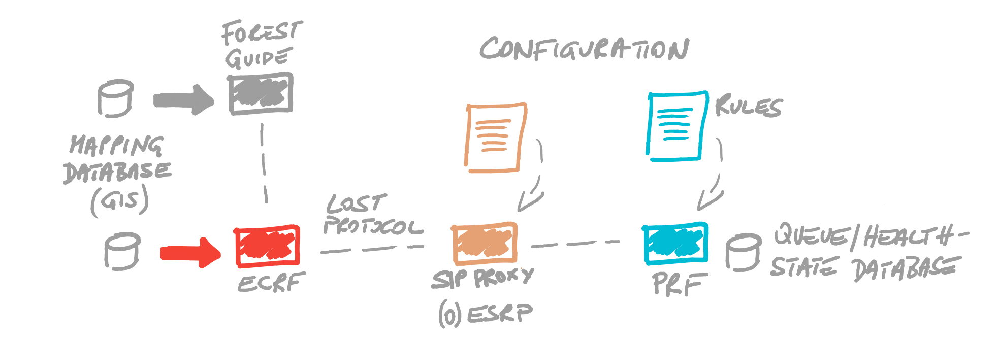
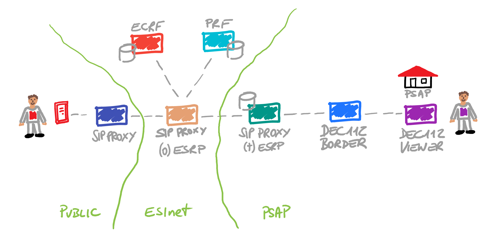
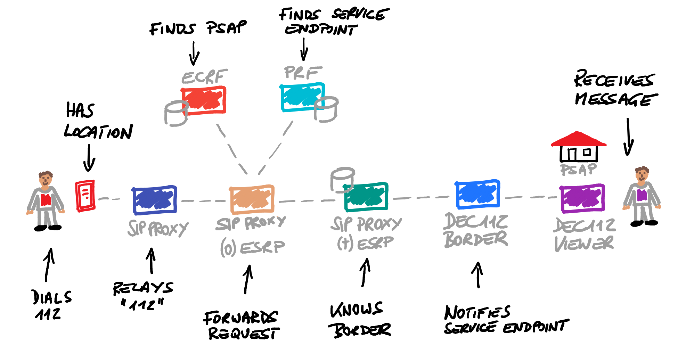

# DECTS Emergency Service Infrastructure 
The following gives a brief overview of the emergency service infrastructure, its basic configuration and interaction.

### Acronyms
API ... Application Programming Interface\
APP ... Application\
BE ... Backend\
ECRF ... Emergency Call Routing Function\
ESInet ... Emergency Service IP network\
ESRP ... Emergency Service Routing Proxy\
GIS ... Geographic Information System\
IP ... Internet Protocol\
LoST ... Location to Service Translation\
SIP ... Session Initiation Protocol\
SMS ... Short Message Service\
PRF ... Policy Routing Function

### Application, Root API and Registration API
In the first step of the DECTS APP onboarding process, the APP sends a request to the Root API to receive a list of available Root API URLs. Basically, such URLs point to regional or national Reg API endpoints allowing to set country specific attributes right after a user has selected the home country via the APP (refer to step 1 in the following figure).

In the second step (2 in the following), the user provides the mobile number of the devices, which is sent in a configuration request to the RegAPI. This triggers an SMS sent to the device to verify the mobile number (step 3), and, in case of a successful verification, the Reg API service generates all SIP attributes necessary to configure the APP's SIP endpoint and to insert a new SIP subscriber into the subscriber database shared with the SIP Proxy (refer to step 4 in the following figure). From now on the APP's SIP endpoint can register at the proxy and initiate emergency chats.

Optional this setup can be run once or in each country.

Independent if the onboarding, a user may store personal identifiable data in a data vault (refer to step 5 in the figure above).

### Terminating ESRP, Border and Service Endpoint
The registration process at the terminating end is slightly different and requires a few static configurations. In a first step (1 in the figure below), the DEC112 Border registers at the so called terminating ESRP, basically a SIP Proxy. The terminating ESRP has a preconfigured list of subscribers that may register (e.g.: sip:border@border.dects.dec112.eu). In another step (2) each configured service endpoint (VIEWER or Training BOT) subscribes at the DEC112 Border to receive notifications in case an emergency message for the specific service endpoint is received. The requested service endpoint is identified by a specific SIP header value which is inserted by the PRF (based on a condition that matches a certain attribute in the initial request message, e.g. an emergency number or a service urn).

In addition, the DEC112 Border notifies the PRF about the current subscription state - for instance, which service endpoints have successfully subscribed to events. In case a specific endpoint is offline, the PRF may chose a default service endpoint.

Optional this setup can be run once or in each country.

### Originating ESRP, ECRF and PRF
ESRP, ECRF and PRF make up the ESInet core services. The main tasks of these services are to find the proper PSAP based on location information and service request (sos, ambulance, fire, police, ...) and to route the received SIP request to the next hop. In addition, rules may be in place to retarget requests (in case a SIP endpoint of a specific region is unavailable) or to add additional information (e.g. a proper service endpoint) to the forwarding. Each element is preconfigured to provide a specific functionality (e.g. rules at the PRF) or to know which service to query (e.g. the ESRP connects to the ECRF and the PRF), refer to the figure below

Depending on how ESInet core services are deployed, there might be a need to maintain a LoST hierarchy that includes an ECRF acting as forest guide or root entity. In the case of DECTS, we decided to use another valid option that utilizes the PRF for specific routing actions needed in a multi country environment. Basically, a PRF rule that considers requests that may not have a valid mapping in ECRF's GIS database are routed based on the SIP domain the request is originating from. 

### Public, ESInet and PSAP Domains
Summarizing, the DECTS Emergency Service Infrastructure can be divided into Public, ESInet and PSAP domains as illustrated in the figure below. Depending on how emergency services are organized, e.g. in Austria there are PSAPs per Federal State and organization (fire/police/ambulance), there might be several PSAP domains that connect to a countrywide ESInet.

An example call flow is shown in the following section.

### End-to-end Path
Putting everything together, the following figure illustrates an emergency call (from left to right) that includes the following steps:

1. user dials an emergency number (or presses a button to select a service)
2. mobile device gets the current location and initiates an emergency call
3. SIP Proxy (APP service provider) peers with a local ESInet, detects a service urn or emergency number and relays the request to originating ESRP (within the ESInet)
4. originating ESRP requests mapping information at ECRF which finds a PSAP based on location and service request (let’s assume sip:border@border.dects.dec112.eu)
5. in a next step the ESRP checks via PRF if there are any rule conditions that match and return specific actions before the request is being forwarded the PSAPs terminating ESRP. In our case the PRF inserts a SIP header field to identify service endpoints. For instance, if the user selects 112 the PRF would insert the VIEWER as service endpoint or if 5112 would have been selected, the PRF inserts the training BOT as service endpoint
6. assuming the DEC112 Border has registered the terminating ESRP as sip:border@border.dects.dec112.eu, the terminating ESRP knows the current Border IP address and forwards the request accordingly.
7. in case the request is received at the Border, the Border service notifies the VIEWER, and
8. a call talker receives the message and may start a chat conversation 

